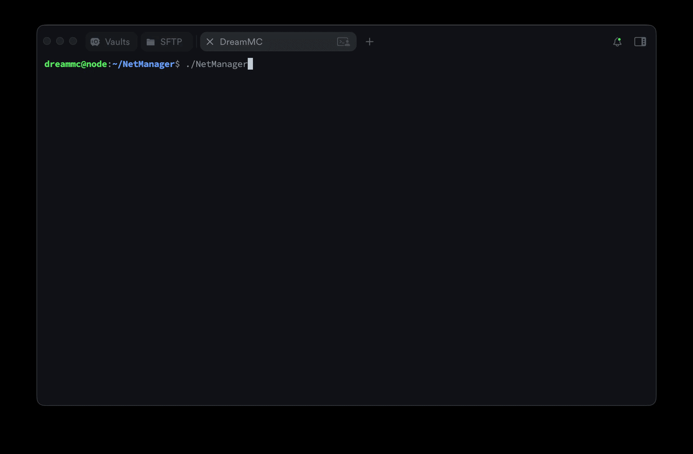

# NetManager

> **Note:** This repository is a public mirror of the original private repository maintained by the DreamMC Network organization. It is published for portfolio and reference purposes.

> **Status:** Minimum Viable Product — Proof of Concept. This project is in an early prototype phase. APIs, configuration, and behaviour are subject to change.

A CLI-driven orchestration tool for managing **DreamMC Network** Minecraft services running on Kubernetes. NetManager handles the full lifecycle of Paper game servers and Velocity proxy servers — from building Docker images and pushing them to a container registry, to deploying and monitoring pods in a cluster.

---



---

## Related repositories

| Repository | Description |
|---|---|
| [DreamMC API](https://github.com/Shadxv/dreammc-api) | Shared Java library consumed by all Paper and Velocity services |
| [NetManager-RestAPI](https://github.com/Shadxv/NetManager-RestAPI) | REST API backend — authentication, users, roles |
| [NetManager-Panel](https://github.com/Shadxv/NetManager-Panel) | Web-based management panel |

---

## Overview

NetManager targets the infrastructure layer of a Minecraft server network. Instead of manually applying Kubernetes manifests or writing Dockerfiles, operators use an interactive console and REST API to:

- Create new Paper / Velocity service definitions through a guided wizard
- Build versioned Docker images and push them to a Harbor registry
- Deploy services as StatefulSets on a Kubernetes cluster
- Monitor pod status and service health
- Communicate with running services over Redis pub/sub

---

## Features

| Area | What it provides |
|---|---|
| **Service wizard** | Step-by-step creation of Paper/Velocity services with auto-fetched versions from PaperMC API |
| **Image management** | Docker image build, version tagging, and push to Harbor registry |
| **Kubernetes deployment** | StatefulSet and Service creation with health checks and environment injection |
| **Interactive console** | Colour-coded CLI with real-time output and background task support |
| **REST API** | HTTP gateway (port `4000`) for programmatic service listing |
| **Redis integration** | Pub/sub packet communication matching the DreamMC API channel convention |

---

## Requirements

| Requirement | Version |
|---|---|
| Go | 1.22.7+ |
| Docker daemon | 27.x+ |
| Kubernetes cluster | 1.28+ (in-cluster or `~/.kube/config`) |
| Redis | 7.x+ |
| MongoDB | 6.x+ |
| Harbor registry | 2.x+ |

---

## Building

```bash
# macOS
./scripts/build.sh macos

# Linux (amd64)
./scripts/build.sh linux
```

The compiled binary is placed at `./bin/NetManager`.

---

## Configuration

See [docs/configuration.md](docs/configuration.md) for the full reference.

Quick start — create the following files in the `config/` directory before the first run:

```
config/
├── config.json     # Service name and network group
├── redis.json      # Redis connection
├── harbor.json     # Container registry credentials
└── mongodb.json    # MongoDB connection URI
```

Missing files are auto-created with empty defaults on first launch.

---

## Usage

See [docs/usage.md](docs/usage.md) for detailed command reference and examples.

```bash
# Start NetManager
./bin/NetManager

# Inside the console
service create <name>      # Launch creation wizard
service list               # Show all defined services
service build <name>       # Build Docker image
service start <name>       # Deploy to Kubernetes
service stop <name>        # Tear down Kubernetes resources
service listpods <name>    # List running pods for a service
```

---

## REST API

The embedded HTTP gateway starts on port `4000`.

| Method | Path | Description |
|---|---|---|
| `GET` | `/gateway/v1/services/` | List all Paper and Velocity services |

---

## Directory structure

```
NetManager/
├── cmd/app/          # Application entry point
├── api/              # REST API (chi router, v1 controllers)
├── internal/         # Core business logic (unexported)
│   ├── cli/          # Interactive console and command dispatch
│   ├── config/       # JSON config loading and persistence
│   ├── docker/       # Docker image build and push pipeline
│   ├── kubernetes/   # K8s client — StatefulSet/Service management
│   ├── minecraft/    # Service wizard, Paper/Velocity models
│   ├── module/       # Module system (lifecycle management)
│   ├── redis/        # Pub/sub client and packet listeners
│   ├── mongodb/      # MongoDB client
│   └── service/      # Service abstraction and manager
├── pkg/              # Exported utilities, interfaces, types, packets
├── scripts/          # Build scripts
└── docs/             # Documentation
```

---

## About

NetManager was created as part of the **DreamMC Network** infrastructure project. This proof-of-concept demonstrates automated Kubernetes orchestration for a Minecraft server network, integrating with the [DreamMC API](https://github.com/Shadxv/dreammc-api) library used by all deployed services.

The source code in this repository represents the public mirror of the internal development repository and may not reflect the latest internal state.
